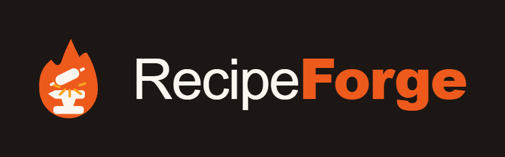

<div align="center">
  
  <br /><br />
  <p><strong>SaaS multi-restaurante para estandarizar la cocina profesional: fichas técnicas, escandallo, inventario, proveedores y carta digital con QR.</strong></p>
  <p>
    
    
    
    
    
    
    
    
  </p>
</div>

---

## Qué es RecipeForge

RecipeForge es una aplicación web **full-stack y multi-tenant** pensada para cocinas profesionales. Cada restaurante trabaja en su propio espacio aislado, con sus usuarios, roles, recetas y branding.

El objetivo es **estandarizar un restaurante**: que cualquier cocinero abra una ficha y reproduzca el plato igual (cantidades, tiempos, procedimiento y foto), que el dueño controle el coste de cada plato (escandallo/food cost), gestione su inventario y proveedores, y publique una **carta digital con QR** para la sala.

Está pensada para el uso real de cocina: alto contraste, tipografía grande, legible con prisa y manos ocupadas, e instalable como PWA en móvil/tablet.

---

## Características

### Fichas técnicas
- Editor dinámico: añade o quita ingredientes y pasos sin recargar.
- Ingredientes **agrupados** por partida (proteínas, vegetales, salsas…).
- Pasos de producción con **tip técnico** por paso.
- Foto del producto final, código de referencia por restaurante y **control de revisiones** automático.
- **Plantillas de ficha** intercambiables por restaurante y por receta, con color de acento.
- **Exportación A4** fiel para imprimir (fondos de color respetados, escala 100 %).

### Escandallo / food cost
- Coste por insumo y por receta a partir de formatos de compra reales.
- Soporte de formatos por **unidad, peso y pack/caja** (con niveles de empaque).
- Cálculo de coste por ración y margen.

### Inventario y proveedores
- Insumos con peso total, presentación por pack, stock mínimo y estado.
- Vista de tabla con agrupación por partida.
- Proveedores con formatos y precios de compra.

### Carta digital con QR
- Página **pública read-only** por restaurante (sin login), servida desde el dominio activo.
- Marca de platos "en carta" con sección, precio y descripción propios; foto por plato.
- **QR independiente** para la carta y para los "especiales fuera de carta".
- Especiales con clasificación (temperatura/categoría/formato) y speech de venta.
- Diseño gastronómico dedicado, con las fotos de los platos como protagonistas.

### Multi-tenant, planes y roles
- Aislamiento estricto de datos por restaurante (acceso cruzado → 404).
- Sistema de **planes** con features gateadas (`PLAN_FEATURES`) y **roles** (dueño, gestor, editor, solo lectura, superadministrador).
- El dueño gestiona su propio equipo y solicita mejoras de plan (autoservicio).
- Configuración de **moneda** por restaurante, aplicada en toda la app.

### Plataforma
- Autenticación **JWT** (access + refresh) con cierre de sesión por inactividad.
- **PWA** instalable.
- Almacenamiento de imágenes en objeto S3-compatible, servido directo por CDN con proxy de respaldo.

---

## Arquitectura

Monorepo con backend Django y frontend React desacoplados por API REST.

### Backend — apps Django
| App | Responsabilidad |
|---|---|
| `accounts` | Restaurantes (tenants), usuarios, membresías/roles, planes y features, moneda, autenticación JWT |
| `recipes` | Fichas técnicas (receta, ingredientes, pasos), carta pública y especiales |
| `costeo` | Escandallo / food cost, unidades y conversiones, formatos de compra |
| `catalog` | Inventario de insumos y proveedores |
| `config` | Configuración del proyecto (settings, urls, wsgi) |

### Frontend — React
- `App.jsx` — shell de la aplicación y ruteo por secciones (incluye detección de rutas públicas de carta antes del login).
- `components/` — secciones (recetas, escandallo, inventario, proveedores, carta y QR, usuarios/roles, plan, ajustes) y páginas públicas.
- `lib/` — clientes de API y utilidades (moneda, costeo, carta/QR, alérgenos).
- `auth.js` — capa de sesión JWT (guardado, refresco, `authFetch`).
- `templates/` — plantillas de ficha para export A4.

---

## Stack tecnológico

### Backend
- **Python 3.12** · **Django 6** · **Django REST Framework**
- **SimpleJWT** para autenticación
- **PostgreSQL** en producción (SQLite en desarrollo), vía `dj-database-url`
- **django-storages + boto3** para almacenamiento de objetos S3-compatible
- **Pillow** para imágenes · **Gunicorn** como servidor WSGI

### Frontend
- **React 19** · **Vite 8** · **Tailwind CSS 4**
- `fetch` nativo con capa `authFetch` (JWT + refresh)
- PWA (service worker + manifest)

---

## Modelo de datos (resumen)

> Vista estructural; no incluye datos de ningún restaurante.

### `accounts`
- **Restaurant** — tenant: nombre, logo, prefijo de código, plantilla por defecto, moneda, plan, slug público, estado de publicación de carta.
- **User / Membership / Role** — usuarios y su rol dentro de un restaurante (permisos efectivos = plan **AND** rol).
- **PlanChangeRequest** — solicitud de cambio de plan del dueño hacia el superadministrador.

### `recipes`
- **Recipe** — código, nombre, categoría, descripción, revisión, raciones, rendimiento, tiempos, vida útil, alérgenos, foto; más campos de carta (`on_menu`, `menu_section`, `menu_price`, `menu_description`, `menu_photo`).
- **IngredientLine** — ingrediente agrupado con cantidad, unidad y nota. Ordenable.
- **ProductionStep** — paso con título, instrucción y tip. Ordenable.
- **Especial** — plato "fuera de carta" con precio, speech de venta, clasificación y foto.

### `costeo` / `catalog`
- Formatos de compra (unidad/peso/pack), insumos de inventario (peso, pack, stock mínimo) y proveedores con precios.

---

## API REST (forma general)

Base: `/api/`. La mayoría de endpoints requieren **JWT** (`Authorization: Bearer <token>`) y están **aislados por restaurante** según el token.

| Área | Endpoints (ejemplos) | Notas |
|---|---|---|
| Auth | `POST /api/auth/token/`, `POST /api/auth/refresh/`, `GET /api/auth/me/` | Login por email, refresco, perfil + permisos |
| Recetas | `GET/POST /api/recipes/`, `GET/PUT/PATCH/DELETE /api/recipes/{id}/` | JSON o `multipart/form-data` (foto) |
| Carta | `PATCH /api/carta/settings/`, campos de carta en `recipes` | Publicar carta, marcar platos |
| Especiales | `GET/POST/PATCH/DELETE /api/especiales/{...}` | CRUD gateado por plan + rol |
| Escandallo / Inventario / Proveedores | endpoints de `costeo` y `catalog` | Gateados por plan |
| **Público (sin login)** | `GET /api/public/carta/{slug}/`, `GET /api/public/especiales/{slug}/` | Read-only, **sin datos internos** (nada de costes) |

El acceso a otro tenant devuelve **404**. Los endpoints públicos nunca exponen costes ni información interna.

---

## Autenticación y multi-tenancy

- **JWT** (access + refresh) emitido en el login; el frontend refresca automáticamente y cierra sesión por inactividad.
- El **tenant** se deriva del token: cada consulta se filtra por el restaurante del usuario.
- **Permisos efectivos = plan AND rol.** Las features se gatean con `PLAN_FEATURES` en backend y su equivalente en frontend; los roles definen qué puede hacer cada usuario dentro de su restaurante.

---

## Sistema de diseño

- **"La Línea"** — el shell de la app: mundo de cocina profesional (zona caliente oscura sobre superficie de acero), tipografía condensada para rótulos, mono solo para medidas. Enfocado en legibilidad en cocina real.
- **Cartas públicas** — mundo propio, gastronómico y editorial, con las fotos de los platos como protagonistas. Deliberadamente distinto del shell porque su público es el comensal, no la cocina.

---

## Estructura del proyecto

```
recipeForge/
├── backend/
│   ├── config/            # settings, urls, wsgi
│   ├── accounts/          # tenants, usuarios, roles, planes, auth JWT
│   ├── recipes/           # fichas técnicas + carta + especiales
│   ├── costeo/            # escandallo / food cost
│   ├── catalog/           # inventario + proveedores
│   ├── manage.py
│   └── requirements.txt
├── frontend/
│   ├── src/
│   │   ├── App.jsx        # shell + ruteo por secciones
│   │   ├── components/    # secciones + páginas públicas
│   │   ├── lib/           # clientes API + utilidades
│   │   ├── auth.js        # sesión JWT
│   │   └── templates/     # plantillas de ficha A4
│   ├── index.html
│   └── package.json
├── docs/
├── netlify.toml           # config de hosting del frontend
├── render.yaml            # config de hosting de la API
└── README.md
```

---

## Cómo ejecutar en local

### Requisitos previos
- Python 3.12+
- Node.js 20+

### Backend

```bash
cd backend

python -m venv .venv
.venv\Scripts\activate          # Windows
# source .venv/bin/activate     # macOS / Linux

pip install -r requirements.txt
```

Crea un archivo `.env` en `backend/` con tu propia configuración (**no lo subas al repo**). Variables típicas:

```
DEBUG=True
SECRET_KEY=...                  # tu clave local
DATABASE_URL=                   # vacío → usa SQLite en desarrollo
# Credenciales de almacenamiento de objetos, solo si usas R2/S3 en local
```

```bash
python manage.py migrate
python manage.py runserver
# → API en http://localhost:8000
```

### Frontend

```bash
cd frontend
npm install
npm run dev
# → App en http://localhost:5173
```

> Nunca se versionan `.env`, credenciales ni respaldos de base de datos. Todo eso queda fuera del control de versiones.

---

## Despliegue (arquitectura)

Producción desacoplada:

- **API** — servidor de contenedores (config en `render.yaml`), Gunicorn + WSGI.
- **Base de datos** — PostgreSQL gestionado.
- **Frontend** — hosting estático + CDN con SPA fallback (config en `netlify.toml`).
- **Imágenes** — almacenamiento de objetos S3-compatible servido directo por CDN (dominio propio), con proxy de respaldo desde la API.
- **CORS/CSRF** — orígenes de producción permitidos por configuración.

Los respaldos de base de datos se hacen con `pg_dump` antes de cada despliegue y **no** se versionan.

---

## Roadmap

Hecho y en producción:
- [x] Fichas técnicas + export A4 + plantillas
- [x] Escandallo / food cost, inventario y proveedores
- [x] Multi-tenant, planes con features gateadas y roles
- [x] Autoservicio del dueño (equipo + solicitud de mejora de plan)
- [x] Configuración de moneda por restaurante
- [x] Carta digital con QR + especiales fuera de carta
- [x] Almacenamiento de imágenes por CDN + PWA

En camino:
- [ ] Multi-local para un mismo dueño (varios establecimientos)
- [ ] Menús (menú del día con rotación cíclica, grupos, eventos) reutilizando recetas/escandallos
- [ ] Correo transaccional + autoservicio de cuentas (registro a prueba, recuperar contraseña)
- [ ] Página pública de presentación
- [ ] Pagos por suscripción
- [ ] Respaldos automatizados

---

<div align="center">
  <sub>Django · DRF · SimpleJWT · React · Vite · Tailwind CSS · PostgreSQL · PWA</sub>
</div>
